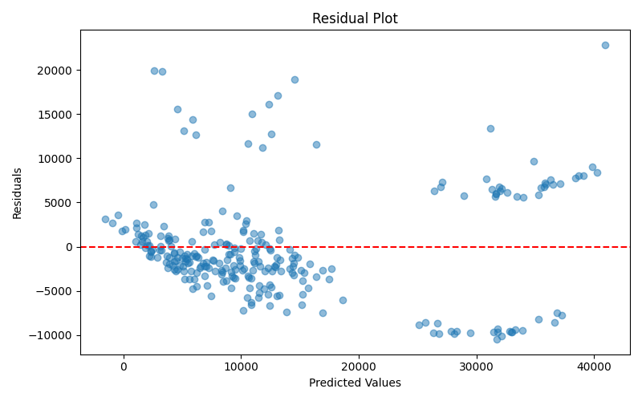

# Multiple Linear Regression on Medical Insurance Cost Dataset

## Project Overview

This project implements a Supervised Machine Learning model to predict individual medical insurance costs using Multiple Linear Regression.

The objective is to demonstrate a complete machine learning workflow — from data preprocessing and categorical encoding to model training and evaluation — using a real-world dataset of 1,338 medical records.

The model estimates medical insurance charges based on demographic and health-related attributes and identifies key factors influencing healthcare expenditure.

---

## Dataset Description

- **Total Records:** 1,338
- **Total Features:** 6 input variables + 1 target variable
- **Target Variable:** `charges` — Individual medical insurance cost

| Feature  | Description |
|----------|-------------|
| Age      | Age of the primary beneficiary |
| Sex      | Gender of the insurance contractor (female, male) |
| BMI      | Body Mass Index (kg/m²) |
| Children | Number of dependents covered by insurance |
| Smoker   | Smoking status (yes, no) |
| Region   | Residential area in the US (northeast, southeast, southwest, northwest) |

---

## Methodology

This project follows a structured machine learning pipeline:

### 1. Data Preprocessing
- Dataset loading and validation
- Verification of data types
- Handling of missing values (if present)

### 2. Feature Encoding
Categorical variables (`sex`, `smoker`, `region`) are converted into numerical format using **One-Hot Encoding**. This prevents implied ordinal relationships and the dummy variable trap (by dropping one category).

### 3. Data Partitioning
The dataset is split into:
- **80%** Training Set
- **20%** Testing Set

This ensures evaluation on unseen data to assess generalization performance.

### 4. Model Training
A Multiple Linear Regression model is trained using:

$$y = \beta_0 + \beta_1x_1 + \beta_2x_2 + ... + \beta_nx_n + \epsilon$$

Where **β** represents learned coefficients and **ϵ** represents residual error.

### 5. Model Evaluation
The model is evaluated using:
- **Mean Squared Error (MSE)**
- **R² Score** (Coefficient of Determination)

---

## Project Structure

```
medical-cost-mlr/
│
├── data/                   # Dataset files
├── notebooks/              # Exploratory Data Analysis (EDA)
├── src/                    # Modular source code
│   ├── data_loader.py
│   ├── preprocessing.py
│   ├── model.py
│   ├── evaluate.py
│   └── visualize.py
│
├── scripts/
│   └── download_data.sh    # Dataset download script
│
├── main.py                 # Pipeline entry point
├── requirements.txt        # Dependencies
└── README.md
```

---

## How to Run the Project

### 1. Clone the Repository
```bash
git clone https://github.com/smurftyy/medical-cost-mlr.git
cd medical-cost-mlr
```

### 2. Create a Virtual Environment
```bash
python3 -m venv venv
source venv/bin/activate
```

### 3. Install Dependencies
```bash
pip install -r requirements.txt
```

### 4. Download the Dataset
```bash
mkdir -p data
curl -L -o data/insurance.csv \
https://raw.githubusercontent.com/stedy/Machine-Learning-with-R-datasets/master/insurance.csv
```

Or run the script:
```bash
bash scripts/download_data.sh
```

### 5. Execute the Model
```bash
python main.py
```

---

## Results

| Metric | Value |
|--------|-------|
| Mean Squared Error (MSE) | 33,596,915.85 |
| R² Score | 0.7836 |

**Residual Plot:**

After running `python main.py`, a residual plot is automatically generated and saved as `residual_plot.png` in the project root directory. The plot shows predicted values against residuals to validate linear regression assumptions.



---

## Interpretation

The R² score of **0.7836** indicates that approximately **78% of the variance** in medical insurance charges is explained by the model.

| Feature | Coefficient |
|---------|-------------|
| smoker_yes | +$23,651.13 |
| children | +$425.28 |
| bmi | +$337.09 |
| age | +$256.98 |
| sex_male | -$18.59 |
| region_northwest | -$370.68 |
| region_southeast | -$657.86 |
| region_southwest | -$809.80 |

The feature with the strongest positive influence is **smoker_yes**. Being a smoker increases predicted charges by approximately **$23,651**, holding all other variables constant — dwarfing every other factor including age and BMI.

---

## Limitations

- Assumes a linear relationship between features and target
- Sensitive to multicollinearity
- Cannot capture nonlinear interactions without feature engineering

---

## Future Improvements

- Implement Ridge and Lasso Regression for regularization
- Perform cross-validation for more robust evaluation
- Investigate feature interactions and polynomial regression
- Conduct residual diagnostics to validate regression assumptions
## Reusability

This project is designed to be adaptable to other regression datasets with minimal changes.

See [SETUP.md](SETUP.md) for a full guide on swapping datasets, adjusting preprocessing, and customizing the pipeline.
---

## Author

| | |
|-|-|
| **Name** | Oloyede Al-amin Oladapo |
| **Course** | COS-201 |
| **Institution** | University of Lagos |
| **Year** | 2026 |